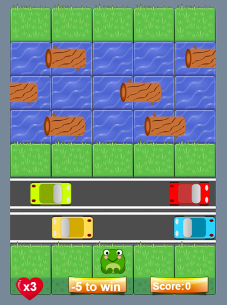

# Project: Arcade Game Clone
### Fend Nanodegree - Exploring JS Objects, Tools and Testing

## Index
* Task;
* Brief introduction;
* How to run this application;
* New skills applied from the Module;
* Required features;
* Additional features;
* Images Credits;
* Sounds Credits;
* License.

### Task

The student is provided of visual assets and a game loop engine. Using these tools is needed to add a number of entities to the game including the player characters and enemies to recreate the classic arcade game Frogger.

### New skills applied from the Module:

* Practice object-oriented programming.

### Brief introduction

In this game you play as the Frog and your goal is to reach the top, without colliding any Car and without to splash into the water otherwise you lose 1 life and the Frog comes again to the initial position.
The Frog can move left, right, up and down by the arrow keys.

When the top is reached, 1 life and 50 points are added. The game is won with 5 visits to the top, and if won points are multiplied by lives saved.

### How to run this application

To run this app is it possible either:

* [__Visit this link__;](https://cristianozitarosa.github.io/froggerClone/)
* Download the gitHub folder on the desktop and launch the index.html file.

### Required features:

* Player can not move off screen;
* Enemies cross the screen;
* Enemy-player collision resets the game;

### Additional features:

* Extended game design to reproduce original Frogger game;
* Cars as enemies instead of bugs;
* Floating Logs to pass the river;
* Road blocks, Frog and Cars designed by me;
* Music;
* Lives, points, ending game management.

### Images credits:

- Canvas blocks from Udacity;
- Road blocks, original stone block from Udacity, altered by me;
- Cars, Logs and Frog designed by me;
- Other images from:
http://www.iconarchive.com/

no attribution required, for personal use.

My alterations to files:

 - If needed exported to PNG format;
 - Rearranged size;

### Sounds credits:

Sound effects from:
https://freesound.org

no attribution required, for personal use.

My alterations to files:
- Changed filenames to organize sounds;
- Converted in mp3;
- Cutted out silence from some files.

### License:

MIT License

Copyright (c) 2018 Cristiano Zitarosa

Permission is hereby granted, free of charge, to any person obtaining a copy of this software and associated documentation files (the "Software"), to deal in the Software without restriction, including without limitation the rights to use, copy, modify, merge, publish, distribute, sublicense, and/or sell copies of the Software, and to permit persons to whom the Software is furnished to do so, subject to the following conditions:

The above copyright notice and this permission notice shall be included in all copies or substantial portions of the Software.

THE SOFTWARE IS PROVIDED "AS IS", WITHOUT WARRANTY OF ANY KIND, EXPRESS OR IMPLIED, INCLUDING BUT NOT LIMITED TO THE WARRANTIES OF MERCHANTABILITY, FITNESS FOR A PARTICULAR PURPOSE AND NONINFRINGEMENT. IN NO EVENT SHALL THE AUTHORS OR COPYRIGHT HOLDERS BE LIABLE FOR ANY CLAIM, DAMAGES OR OTHER LIABILITY, WHETHER IN AN ACTION OF CONTRACT, TORT OR OTHERWISE, ARISING FROM, OUT OF OR IN CONNECTION WITH THE SOFTWARE OR THE USE OR OTHER DEALINGS IN THE SOFTWARE.
